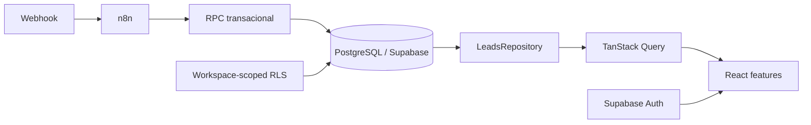
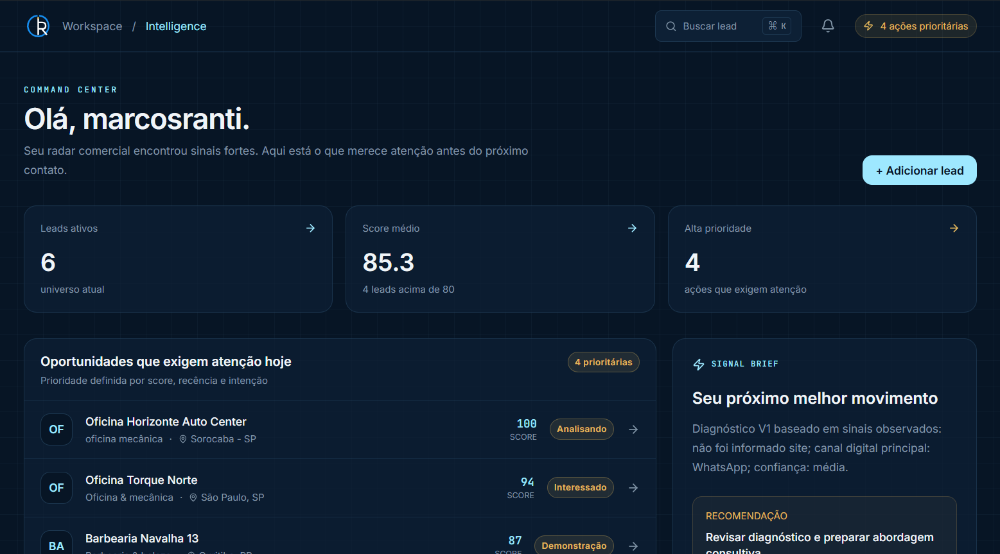
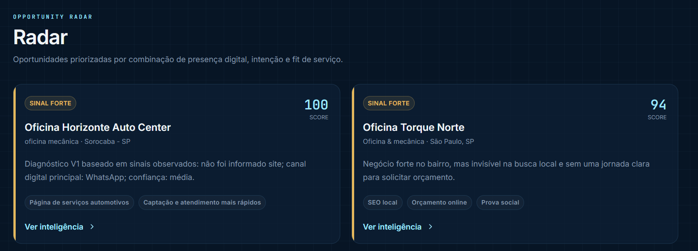
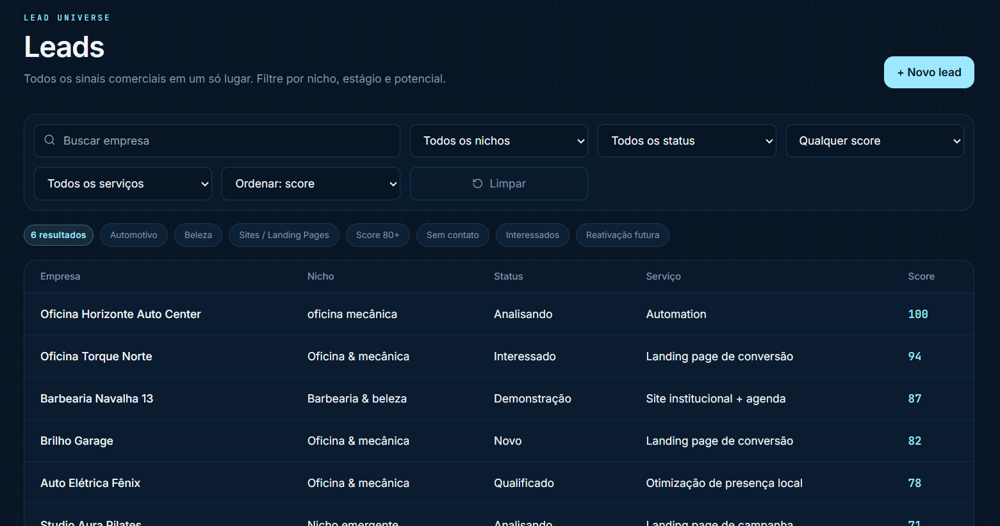
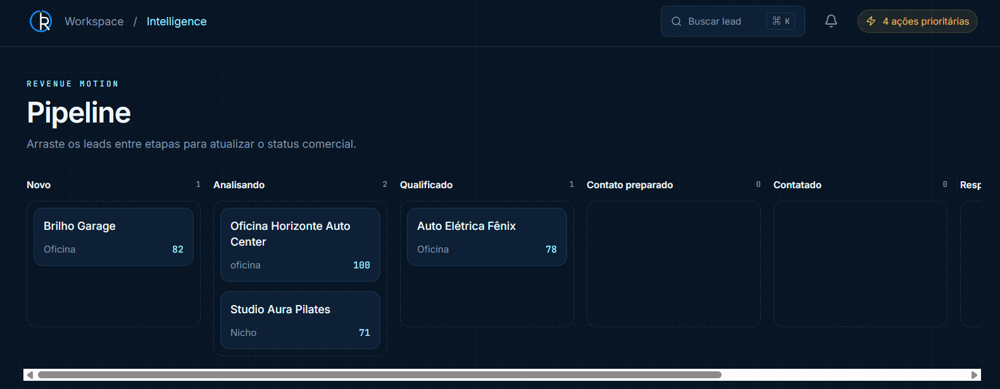
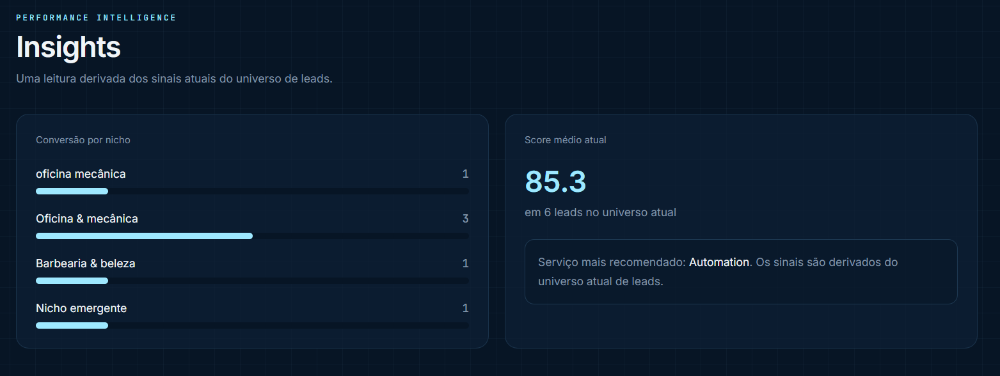

# RanTech Lead Intelligence

Plataforma de inteligência comercial para captação, análise, scoring e organização de leads, preparada para evoluir com agentes de IA.

## Problema

O processo de prospecção costuma espalhar leads em fontes diferentes, dificultar a priorização e perder contexto entre contatos. O produto transforma sinais digitais em oportunidades acionáveis, com diagnóstico, memória comercial e próxima ação.

## Solução

```text
Webhook → n8n → RPC Supabase → PostgreSQL → Repository → TanStack Query → React
```

O workflow `RT | LI | Lead Intake | V1` normaliza, deduplica, analisa e pontua cada entrada. O painel consome os dados por hooks e repository, sem acoplamento à origem.

## Funcionalidades

- Command Center com oportunidades que exigem atenção;
- Radar de oportunidades;
- Leads com busca, filtros, ordenação e paginação;
- Lead Intelligence com diagnóstico e memória comercial;
- Pipeline Kanban responsivo;
- Demos associadas a leads;
- Insights derivados do universo atual;
- scoring auditável, histórico e eventos;
- ingestão automatizada via n8n.

## Arquitetura



`src/domain` contém tipos e regras; `src/services/repositories` define a fronteira de dados; `src/mocks` fica restrito a testes e demonstrações locais; `src/features` organiza as telas por domínio. Veja [docs/ARCHITECTURE.md](docs/ARCHITECTURE.md), [docs/SUPABASE.md](docs/SUPABASE.md) e [docs/SECURITY.md](docs/SECURITY.md).

## Stack

React, Vite, TypeScript, Tailwind CSS, React Router, TanStack Query, TanStack Table, Zustand, React Hook Form, Zod, Radix UI, Lucide, Recharts, dnd-kit, Motion, MSW, Supabase/PostgreSQL, n8n, Vitest, React Testing Library e Playwright.

## Segurança

Supabase Auth protege as rotas; `li_*` usa RLS por workspace; acesso anônimo é bloqueado; a credencial backend fica somente no n8n; nenhuma `service_role`, `sb_secret`, senha ou token é usado no frontend. Consulte [docs/SECURITY.md](docs/SECURITY.md).

## Como executar

```bash
npm install
npm run dev
```

Para MSW local, use `VITE_DATA_SOURCE=msw` e `VITE_USE_MSW=true`. Para o banco real, copie `.env.example` para `.env.local`, preencha somente a chave publishable e use `VITE_DATA_SOURCE=supabase`.

## Qualidade

```bash
npm run build
npm run lint
npm run test
npm run test:e2e
```

Os testes autenticados do Playwright usam `E2E_USER_EMAIL` e `E2E_USER_PASSWORD` apenas no ambiente local/CI; valores reais não são versionados.

## Branding

Os assets oficiais estão em `src/assets/brand/`. `BrandLogo` resolve orientação, tema, tamanho e modo compacto. O favicon oficial e o apple touch icon estão registrados no `index.html`.

## Visão do produto

Capturas reais do deployment publicado:

| Tela | Prévia |
| --- | --- |
| Overview / Command Center |  |
| Radar |  |
| Leads |  |
| Pipeline |  |
| Insights |  |

As imagens não contêm senhas, tokens ou dados pessoais além do identificador visual da conta autenticada de demonstração.

## Roadmap

Enriquecimento, contato assistido e Claudete como futura agente comercial, sem prometer funcionalidades ainda não implementadas.
